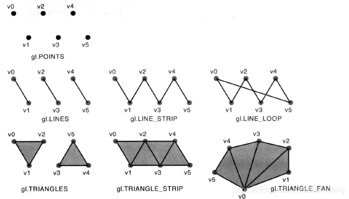

<!--
 * @Author: tangdaoyong
 * @Date: 2020-12-10 17:32:27
 * @LastEditors: tangdaoyong
 * @LastEditTime: 2020-12-10 17:44:09
 * @Description: WebGL - 七种基本图形
-->
# WebGL - 七种基本图形

[`WebGLRenderingContext.drawArrays()`](https://developer.mozilla.org/en-US/docs/Web/API/WebGLRenderingContext/drawArrays)方法从数组数据中呈现基元。
```js
void gl.drawArrays(mode, first, count);
```
`mode`有七种，对应七种基本图形的绘制。
| 基本图形 | 参数 | 描述 |
| - | - | - |
| 点 | gl.POINTS | 一系列的点，绘制在 v0 ,v1,v2.... |
| 线段 | gl.LINES | 一系列单独的线段，绘制在(v0, v1),(v2,v3)...，若点个数使奇数，则最后一个点被忽略 |
| 线条 | gl.LINE_STRIP | 一系列连接的线段，绘制在(v0,v1),(v1,v2)...最后一个点使一条线段的终点 |
| 回路线条 | gl.LINE_LOOP | 一系列连接的线段，与gl.LINE_STRIP相比，最后一个点会与开始的点相连接(vn,v0),线段会闭合 |
| 三角形 | gl.TRIANGLES | 一系列单独的三角形，绘制在(v0, v1, v2),(v3, v4, v5)...，点个数若不是3的倍数，则剩下的被忽略 |
| 三角带 | gl.TRIANGLE_STRIP | 一些列条带状的三角形，前三个点构成第一个三角形，从第二个点开始的三个点构成第二个三角形，以此类推…，(v0,v1,v2),(v2,v1,v3),(v2,v3,v4)... |
| 三角扇 | gl.TRIANGLE_FAN | 一系列三角形组成的类似扇形的图形，前三个点构成第一个三角形，接下来的一个点和前一个三角形的最后一条边组成接下来的一个三角形，被绘制在(v0, v1, v2),(v0, v2, v3),(v0, v3, v4)... |

网了找了张图，直观的反应出七种基本图形的不同之处。

