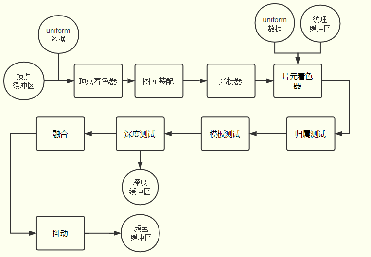
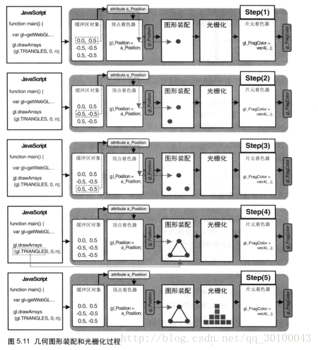

<!--
 * @Author: tangdaoyong
 * @Date: 2020-12-15 09:31:56
 * @LastEditors: tangdaoyong
 * @LastEditTime: 2020-12-15 09:41:06
 * @Description: WebGL流程图
-->
# WebGL流程图

## 介绍

## 渲染管线流程图

### 顶点着色器

`gl_Position`实际上是几何图形装配阶段的输入数据。几何图形装配过程又被称为图元装配过程，因为被装配出的基本图形（点，线，面）又被称为图元。

### 图元装配和光栅化

图元装配任务：

将孤立的顶点坐标装配成几何图形。几何图形的类别由`gl.drwaArrays()`函数的第一个参数决定(`WebGL七种基本图形`)。

光栅化任务：

将装配好的几何图片转化为片元。

`顶点着色器`和`片元着色器`之间的`图形装配`与`光栅化`的过程，如下图：

### 片元着色器