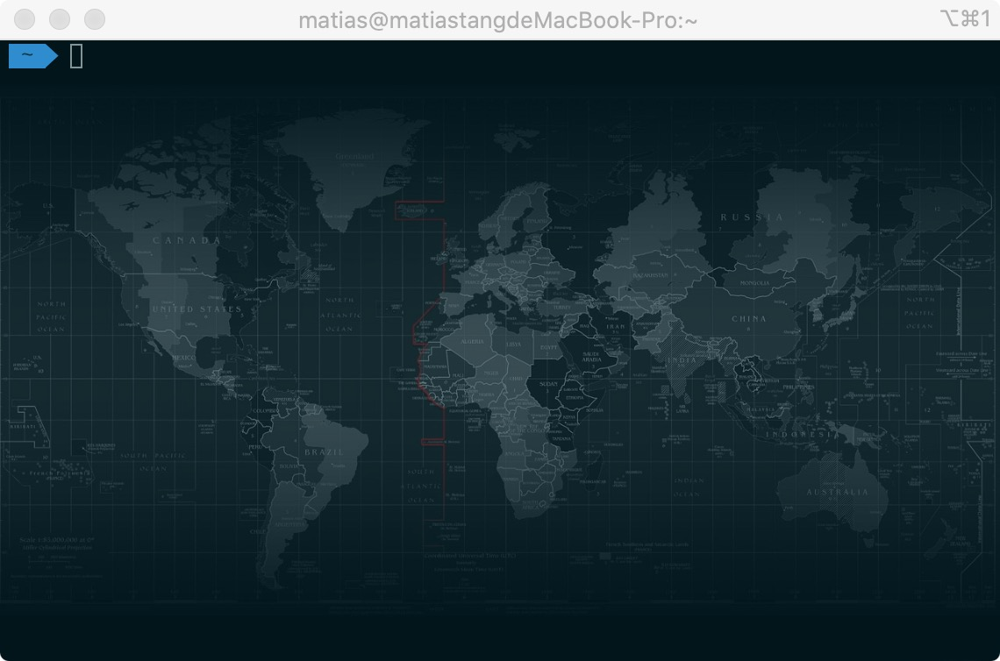

<!--
 * @Author: tangdaoyong
 * @Date: 2020-12-28 17:43:32
 * @LastEditors: tangdaoyong
 * @LastEditTime: 2020-12-28 18:11:26
 * @Description: iTerm
-->
# iTerm

[powerline](https://github.com/powerline/fonts)

## 问题

### 波浪线两边的两个问号

隐藏了用户名和主机名所有看不到前面的问号。


原因：

`agnoster`主题需要特殊的字体支持，因为有非ascii字符编码，这两个问号本来是为了更好看的箭头，但是箭头在当前字体中是不会被显示的。解决方法是重新下载一个支持非ascii编码的字体。

处理：
```
# 1. clone
git clone https://github.com/powerline/fonts.git
# 2.install
cd fonts
./install.sh
# 3. clean-up a bit
cd ..
rm -rf fonts
```

安装[powerline](https://github.com/powerline/fonts.git)字体，然后在`iTerm2`中应用字体 `iTerm` -> `Preferences` -> `Profiles` -> `Text` -> `font` -> `Change Font` 中选择使用 `Meslo` 字体。



### VSCode中的命令行处理`波浪线两边的两个问号`

同样的原因，还是需要设置`VSCode`中的字体。

1. `mac`查看系统安装的字体：
```
# 进入字体目录
cd ~/Library/Fonts
# 查看字体
ls
# 部分结果
Literation Mono Powerline Bold Italic.ttf
Literation Mono Powerline Bold.ttf
Literation Mono Powerline Italic.ttf
Literation Mono Powerline.ttf
```
2. 更改`VSCode`中使用的字体

`Code` -> `Preferences` -> `Settings`搜索`font`在`Font Family`中添加需要使用的字体（需要提前安装到`mac`中，可先查看）如下添加了`Literation Mono Powerline`然后就显示正常了。
```
'Literation Mono Powerline', Menlo, Monaco, 'Courier New', monospace
```
