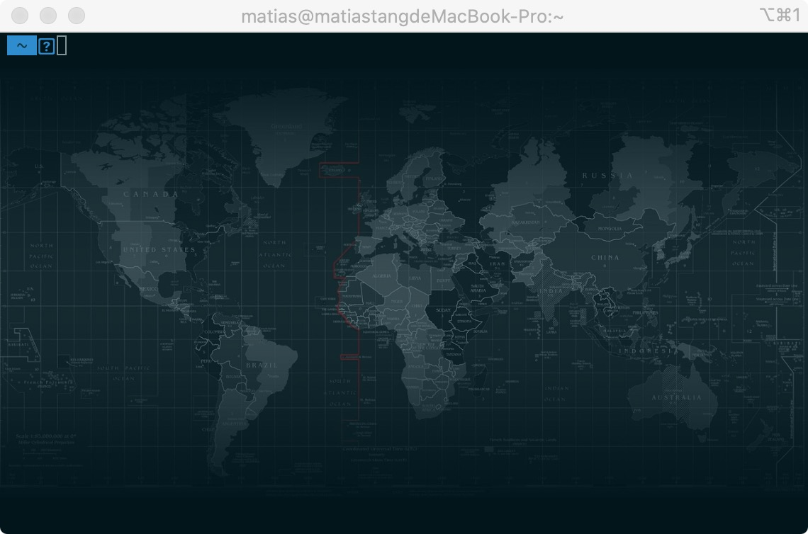

<!--
 * @Author: tangdaoyong
 * @Date: 2020-12-28 17:43:32
 * @LastEditors: tangdaoyong
 * @LastEditTime: 2020-12-28 17:52:02
 * @Description: iTerm
-->
# iTerm

[powerline](https://github.com/powerline/fonts)

## 问题

1. 波浪线两边的两个问号

隐藏了用户名和主机名所有看不到前面的问号。



原因：

`agnoster`主题需要特殊的字体支持，因为有非ascii字符编码，这两个问号本来是为了更好看的箭头，但是箭头在当前字体中是不会被显示的。解决方法是重新下载一个支持非ascii编码的字体。

处理：
```
# 1. clone
git clone https://github.com/powerline/fonts.git
# 2.install
cd fonts
./install.sh
# 3. clean-up a bit
cd ..
rm -rf fonts
```

安装[powerline](https://github.com/powerline/fonts.git)字体，然后在`iTerm2`中应用字体 `iTerm` -> `Preferences` -> `Profiles` -> `Text` -> `font` -> `Change Font` 中选择使用 `Meslo` 字体。

